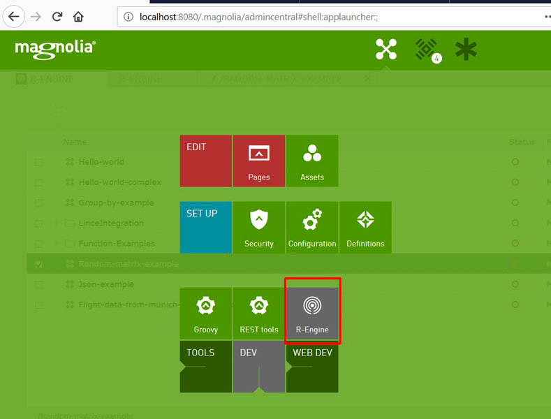
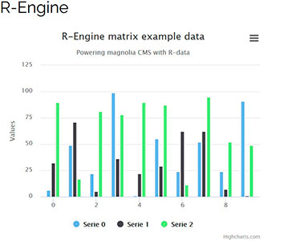
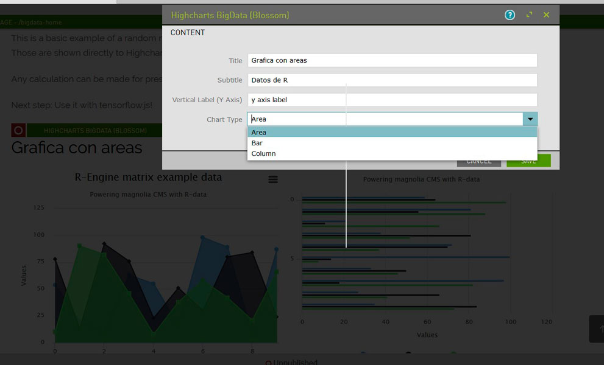
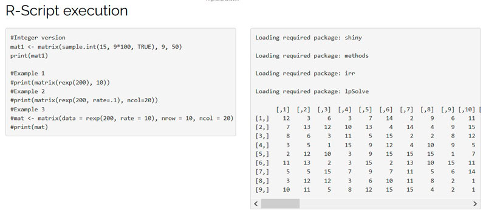

# BigData - Blossom Module template for Magnolia CMS  

Demonstrates how to extend Magnolia CMS behaviour for bigdata and mathematical operations, adding support to R-scripts and Python* (through reticulate) in Magnolia CMS.

Based on Magnolia 5.6

## Features
> Java is and amazing language but it has several problems to analyze multidimensional data. That's why Python and R are "better" to resolve scientific problems. 

> The Bigdata blossom module allows you to create your own scripts and test them against an R Engine. The aim for this it's providing Magnolia CMS with a valid mathematical and statistic tool to manage big amounts of numerical data and create customize calcs for bigdata and machine learning. It will let you have a dashboard and sandbox as an app, and create your customized modules as blossom components, rest api or native spring MVC/REST components

- Adds R-engine app to desktop for live programming in r

- Includes basic executable examples in r

- Adds and extensible way of components for the web, like chart and remote r execution
- Provides Standalone Spring MVC execution out of the blossom module component chain
- Provides Rest end points
- Provides Hightchart Blossom components with asyncronous data

- Provides Remote R script execution as Blossom component

- Includes a basic sandbox web template for live testing and quick component check
- Provides a valid postman template (remember to change your server host!)
- Provides wrapping and helper classes for chart creation through Highcharts

## Usage
> Just compile the project and execute it as a magnolia bundle. 

- Download the full project with maven and java 1.8 already installed in your computer
- **Execute "compile task"*** (*You will see problems in the maven install task because it will try to remote install itself in Magnolia)
- Deploy the generated war in your server
- Works as a bundle. Copy the module into your project directly if you need it.

> Base components and examples for bigdata analysis

- Check com.albertosoto.magnolia.bigdata.spring.rest.RenjinStatsController for a basic example of executing r-code and map the results in java classes
- Check com.albertosoto.magnolia.bigdata.spring.rest.RenjinActionsController for executing repository  

> R-Language & Python

- Remember to learn R-language to use it. It's recommended to check info and CRAN packages as well as RENJIN dependency. Feel free to use any CRAN package as a maven dependency inside the module

- Renjin is the heart of it. First execution will be slower than others. Check any CRAN dependency and it's evolution

- At the moment of installation, Python execution is served as "reticulate" package and, right now, it has problems for execution. Will be solved as far as renjin solves it. 

- The "big" problem out-of-the-box is R plotting. Anyway you can use the example chart component provided through blossom chain. It's not blossom dependant (load data by rest). 

## Demo
> A dummy web template it's included. 

- Although the main concept of the project is not providing webcomponents there are base components as an example to work with it.

## Information on Magnolia CMS
This directory is a Magnolia 'blossom module' delivered as a full project.

https://docs.magnolia-cms.com

## License

MIT

## Contributors

Magnolia CMS, https://magnolia-cms.com

Alberto Soto Fernandez, https://github.com/albertoSoto/

## Rest points
You have a full set of postman rest points available at:
- https://www.getpostman.com/collections/1de9ccfec47b610354e4
- BigData-Magnolia-example.postman_collection.json
- https://documenter.getpostman.com/view/3182810/bigdata-magnolia-example/RW1gEwgG
